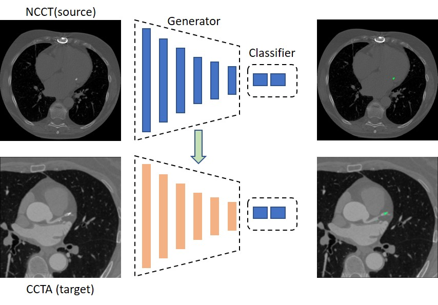

## Coronary artery calcium (CAC) scoring using unsupervised domain adaptation

This is the source code of "Learning coronary artery calcium scoring in coronary CTA (CCTA) from non-contrast CT (NCCT) using unsupervised domain adaptation". An unsupervised domain adaptation method that learns to perform CAC scoring in coronary CT angiography (CCTA) from non-contrast CT (NCCT) is presented. A CAC scoring convolutional neural network is divided into a feature generator that maps input images to features in the latent space and a classifier that estimates predictions from the extracted features. The feature distributions between source domain and target domain are aligned between two domains using adversarial learning, as shown in Figure 1.

<div align="center">
 
 <br>  
 <em align="center">Figure 1: The CNN for CAC detection is divided into a feature generator and a classifier. The feature generator is trained on source domain and is adapted to the target domain using unsupervised domain adaptation. The classifier in the target domain is reused from the source domain.</em>  
</div>

### Preparations
The Python 3.7.6 was used for this project. The required packages can be installed by:
```
pip install -r requirements.txt
```

### Training
Firstly, the CAC scoring network should be trained in source domain [1]. 
A mixed dataset, containing CCTA scans of source domain and NCCT scans of target domain.

To train unsupervised domain adaptation with adversarial learning
```
python trainGAN_adv_cls_MMD.py --w_cls 2 --w_mmd 0.0 --inputdir ./data/NCCT_CCTA/mixCT --scratchdir ./data/NCCT_CCTA/resampled_mixCT --N_Diters 20
```


### Inference
Run the inference on CCTA data with:
```
python TestNet_transf --inputdir ./data/CCTA/mixCT --scratchdir ./data/CCTA/resampled_mixCT --G_experiment 'G_experiemnt_name'
```

### References
* [[1] CalciumScoring](https://github.com/sgmvanvelzen/calcium-scoring)
* [[2] DomainAdaptation](https://github.com/carrenD/Medical-Cross-Modality-Domain-Adaptation)

### Citation
```bibtex
@article{zhai2022Learning,
  title={Learning coronary artery calcium scoring in coronary CTA from non-contrast CT using unsupervised domain adaptation},
  author={Zhai, Zhiwei and G.M. van Velzen, Sanne and Lessmann, Nikolas and Planken, Nils and Leiner, Tim and Isgum, Ivana},
  journal={Frontiers in Cardiovascular Medicine},
  year={2022},
  publisher={Frontiers Media SA}
}
```

